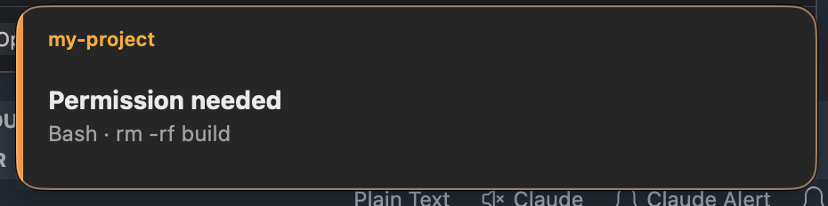
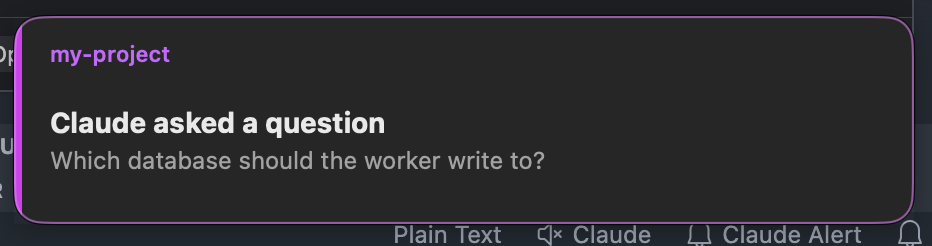
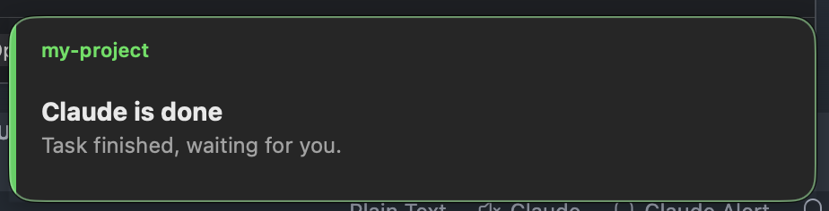

# Claude Floating Alert

When Claude Code or Codex needs an answer, it says so inside the VS Code window
— which is no help once you have switched to another app. This extension shows
the same event as a small alert drawn above every window, full-screen apps and
other Spaces included: permission requests, questions, and finished tasks. A
click on the alert brings up the project it came from, and the chat with it.

macOS only, Apple Silicon.

## The three alerts

**Permission needed** — the agent wants to run a tool. Stays on screen until you
answer.



**A question** — `AskUserQuestion` (`request_user_input` in Codex) is waiting
for your choice. Also stays until you answer.



**Task finished** — closes itself after three seconds.



The alert has no buttons: a click anywhere on it opens the matching folder in
VS Code and dismisses it. You never see one for a window you are already looking
at.

## How it works

1. On activation the extension copies the hook script and the alert binary into
   `~/.claude/floating-alert/` — a stable path that extension updates do not
   break.
2. The bell button in the status bar adds the hooks to `~/.claude/settings.json`
   and, where Codex is set up, to `~/.codex/hooks.json` — or removes them. A
   `.floating-alert.bak` backup of each file is written before the first change.
3. The agent runs `claude-floating-alert.js` on an event; the script spawns the
   alert as a detached process and exits immediately, so the CLI never blocks.
   Codex registrations pass `--agent codex`, which is what names the agent on
   the alert.
4. Every VS Code window publishes its focus state to
   `~/.claude/floating-alert/focus/<pid>.json`, and the hook writes live panel
   data to `run/<session>.json`. A window is matched to a session by
   `VSCODE_IPC_HOOK_CLI` — the window's unique socket, shared with the terminals
   it spawns — falling back to a folder match when the session was not started
   from a terminal. That way a window only ever dismisses its own alerts.

Three events are wired per agent: `PermissionRequest`, `PreToolUse` (matcher
`AskUserQuestion`, `request_user_input` for Codex) and `Stop`. Hooks belonging
to other extensions are left untouched — both agents run every matching group.

Codex adds one step of its own: it runs a hook only after you have trusted it,
and skips new or changed ones silently. Open the Codex panel, go to Hooks in its
settings, and trust the three entries — the extension reminds you once, right
after it writes them.

What decides the alert is the window, not the chat: if a window with that folder
is in front, you are taken to be looking at it. No extension can see which chat
a side bar holds, for Claude Code or for Codex, so a chat sitting in a
background tab of a focused window counts as watched and stays quiet. A click
brings the window forward and leaves it at that.

## What it reads, and what leaves your machine

Nothing leaves your machine. The extension makes no network calls of any kind:
there is no telemetry, no crash reporting, no update check.

Locally it reads the event payload the agent hands the hook — the tool name, the
question text, the working directory — and the `permissions.allow` rules of your
settings files, to say which commands of a shell line are already allowed. Your
session transcripts are not opened at all.

One thing worth knowing: the alert is drawn above every application, and it
shows the folder name plus the tool or question text. On a shared screen or a
recording, that is visible to everyone watching. The bell in the status bar
turns the alerts off altogether.

## Commands

- `Claude Floating Alert: Toggle Hooks` — same as the status bar bell
- `Claude Floating Alert: Show Test Alert`

## Settings

| Setting | Default | |
|---|---|---|
| `claudeFloatingAlert.stop.timeout` | `3` | Seconds before the finished-task alert closes (`0` keeps it up) |

Permission and question alerts ignore the timeout: they stay until you answer
them or return to the window they came from.

## Development

```sh
npm install
npm run watch          # TypeScript
npm run build:native   # rebuild bin/claude-alert from the Swift source
npm run package        # → claude-floating-alert-darwin-arm64-1.0.0.vsix
```

Building the binary needs the Xcode Command Line Tools. Users do not — the
compiled binary ships inside the `.vsix`.

## License

MIT
